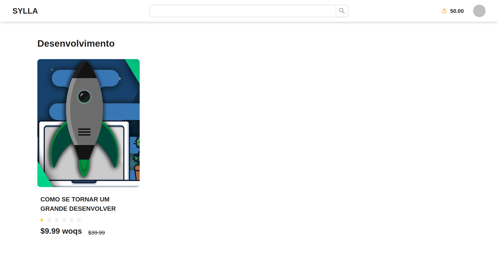
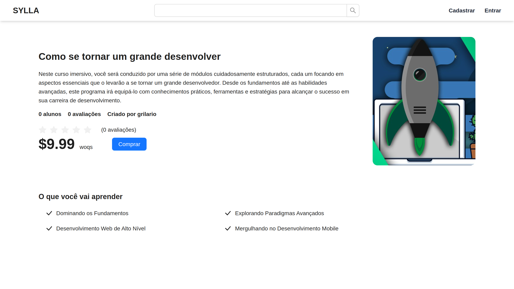
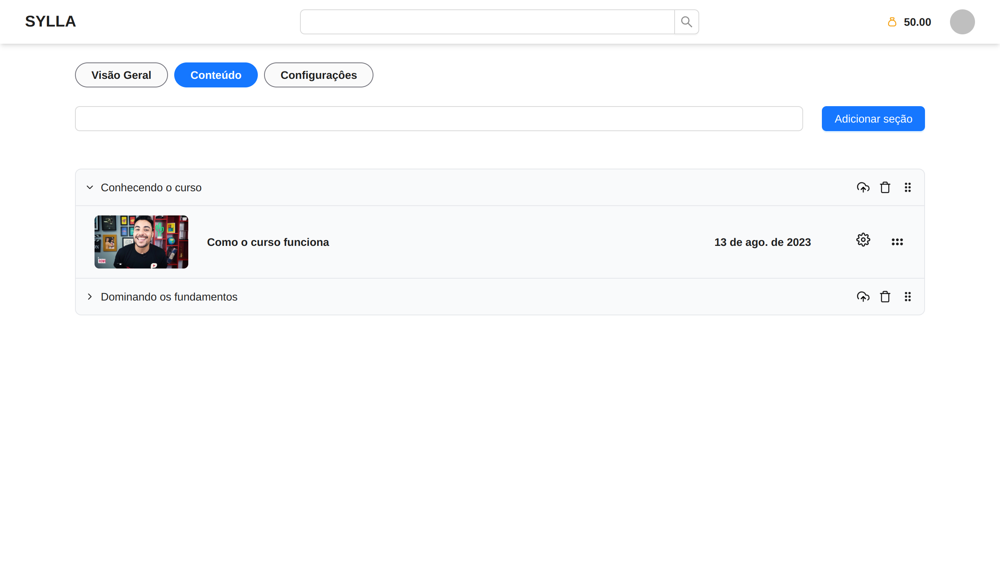
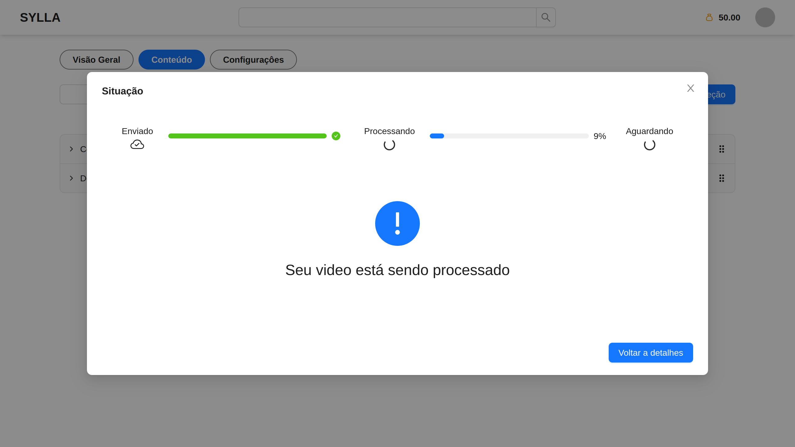
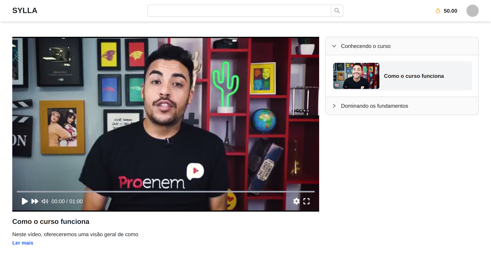

# SYLLA

O "Sylla" é uma plataforma de compartilhamento de cursos, na qual você pode estar criando cursos no formato de vídeos aulas e estar comercializando com uma moeda interna chamada "woqs". Ao entrar na plataforma você ganha 50 "woqs" e já pode comprar alguns curso, a ideia é que caso você queira adquirir mais cursos você terá que produzir um curso na plataforma para conseguir mais moedas, assim formando uma rede aprendizagem.

A plataforma foi feita para o projeto de conclusão de curso do nosso curso de Informática para Internet, nesse repositório você pode encontrar todo o processo de levantamento de requisitos, estudos das ferrementas e prototipação na pasta [docs](./docs/).

### Features

- **Redimensionamento** dos vídeos enviados.
- **Checagem de conteúdo sexual** dentro dos vídeos.
- **Streaming** dos vídeos incorporado na plataforma.
- **Sistema de busca** utilizando full text search do PostgreSQL.
- Organização dos vídeos e seções usando **drag and drop**.

</br>

<p align="center">
    
</p>

<p align="center">
    
</p>

<p align="center">
    
</p>

<p align="center">
    
</p>

<p align="center">
    
</p>

### Executando

Para executar é necessário ter o docker com docker compose, Node JS e pnpm.

#### API

1. Vá para o diretório code:

   ```sh
   cd code
   ```

2. Execute os seguintes comandos:

   ```sh
   docker compose up -d
   docker exec <container> sh -c 'node ace migration:run'
   ```

   _Troque \<container> pelo ID do container da API_

#### WEB

1. Vá para o diretório code/web:

   ```sh
   cd code/web
   ```

2. Instale as dependências:

   ```sh
   pnpm i --frozen-lockfile
   ```

3. Execute a aplicação:

   ```sh
   pnpm dev
   ```
4. Abra o navegador com link: http://localhost:5173/
